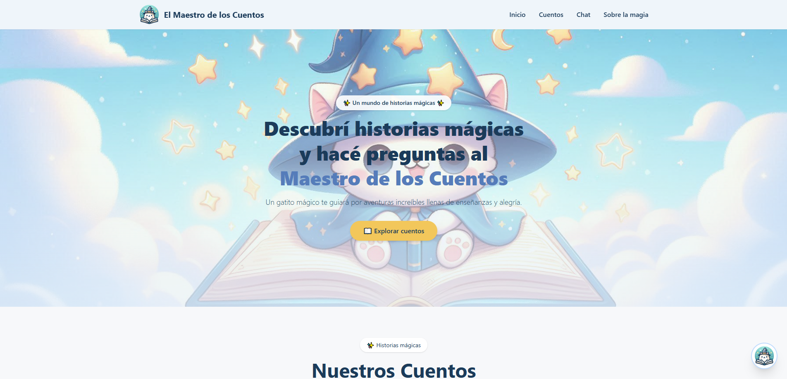
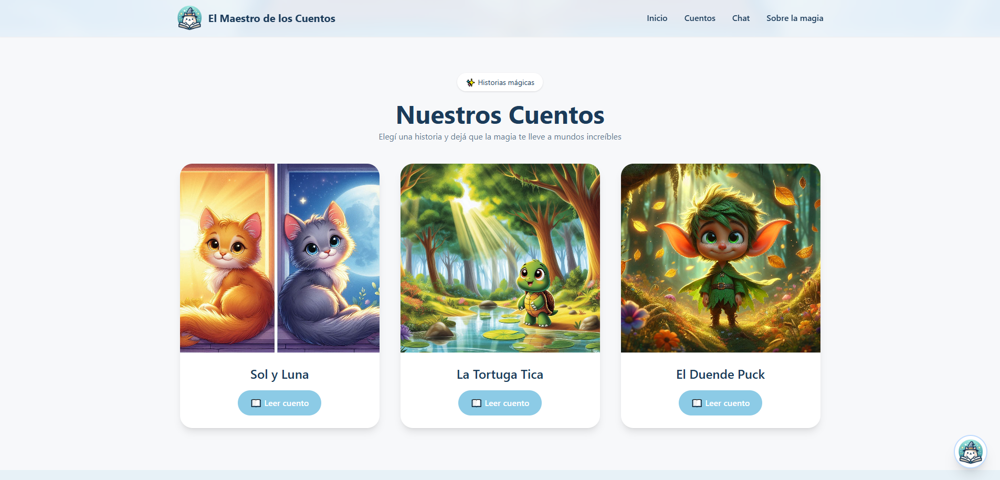
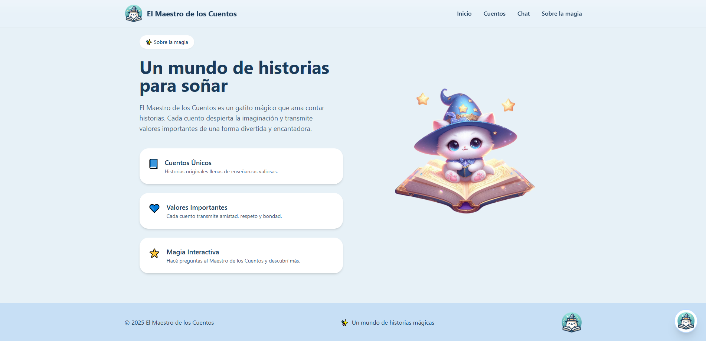
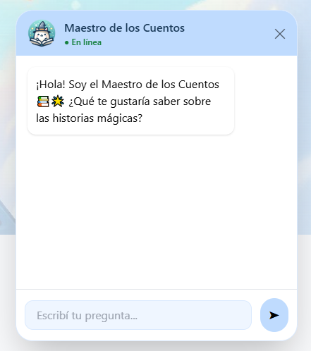

# 🌟 **El Maestro de los Cuentos — App Mágica con RAG + IA + React**

Un mundo encantado donde un gatito narrador responde preguntas sobre historias mágicas 🐱📖✨

---

<div align="center">

### 🌈 *Frontend React + Tailwind • Backend FastAPI • RAG con Cohere + ChromaDB*

---

### 🔥 **Badges del Proyecto**


---

### 🎬 **Demo (GIF)**

> 

> 

---

</div>

# 📸 **Capturas del Proyecto**

### 🌟 Portada / Hero

> 

### 📚 Sección de cuentos



### ✨ Sobre la Magia



### 🐱 Chatbot Mágico




---

# 🧠 **Descripción del Proyecto**

**El Maestro de los Cuentos** es una aplicación interactiva donde los usuarios pueden:

✨ Leer historias ilustradas
✨ Preguntarle al gatito narrador sobre los cuentos
✨ Recibir respuestas basadas 100% en el texto original (RAG)
✨ Disfrutar una experiencia infantil, suave y mágica

Este proyecto combina desarrollo frontend moderno con inteligencia artificial aplicada.

---

# 🚀 **Tecnologías Utilizadas**

### **Frontend**

* React + Vite ⚡
* TailwindCSS
* React Router
* Context API
* Componentes reutilizables (Cards, Hero, ChatWidget)

### **Backend**

* FastAPI
* Cohere API (embeddings + chat)
* ChromaDB (Vector Store)
* Langchain Text Splitters
* RAG de alta calidad (no inventa, no mezcla historias)

---

# 🧠 **Arquitectura RAG**

```
Cuentos → Chunking → Embeddings Cohere → ChromaDB
          ↑                                ↓
       Pregunta ← Cohere Chat ← Recuperación de contexto
```

El modelo:

✔ Responde solo con información presente
✔ Usa tono infantil pedagógico
✔ Incluye emojis
✔ No inventa ni mezcla historias
✔ Máximo 3 oraciones por respuesta

---

# 📁 **Estructura del Proyecto**

```
/maestro-de-los-cuentos
│
├── /frontend
│   ├── src/components
│   ├── src/pages
│   ├── src/services/chatService.js
│   ├── src/data/cuentosData.js
│   └── ...
│
├── /backend
│   ├── rag.py
│   ├── server.py
│   ├── requirements.txt
│   └── .env (ignorar)
│
└── README.md
```

---

# ⚙️ **Instalación**

## 🔷 **1. Backend (FastAPI + RAG)**

```bash
cd backend
python -m venv venv
source venv/bin/activate  # Windows: venv\Scripts\activate
pip install -r requirements.txt
```

Crear `.env`:

```
COHERE_API_KEY=tu_api_key_aqui
```

Ejecutar FastAPI:

```bash
uvicorn server:app --reload
```

---

## 🔷 **2. Frontend (React)**

```bash
cd frontend
npm install
npm run dev
```

Frontend → [http://localhost:5173](http://localhost:5173)
Backend → [http://localhost:8000](http://localhost:8000)

---

# 💬 **API Endpoints**

### `POST /preguntar`

**Body:**

```json
{
  "texto": "¿Cómo ayudó Tica al pájaro?"
}
```

**Response:**

```json
{
  "respuesta": "Tica le dio un lugar seguro en su caparazón 🐢💕 ..."
}
```

---

# 🌈 **Características del Chat**

✔ Burbujas alineadas
✔ Autoscroll
✔ “El Maestro está escribiendo…”
✔ Entrada con enter o botón
✔ Avatar mágico
✔ Cierre suave del widget

---

# 🔒 **Reglas de Seguridad implementadas**

* No responde cosas inventadas (hallucination control)
* No combina historias distintas
* No responde sobre información no presente
* No da datos sensibles
* Estilo infantil seguro

---

# 👩‍💻 **Autora**

### **Agostina Rocío Torres**


